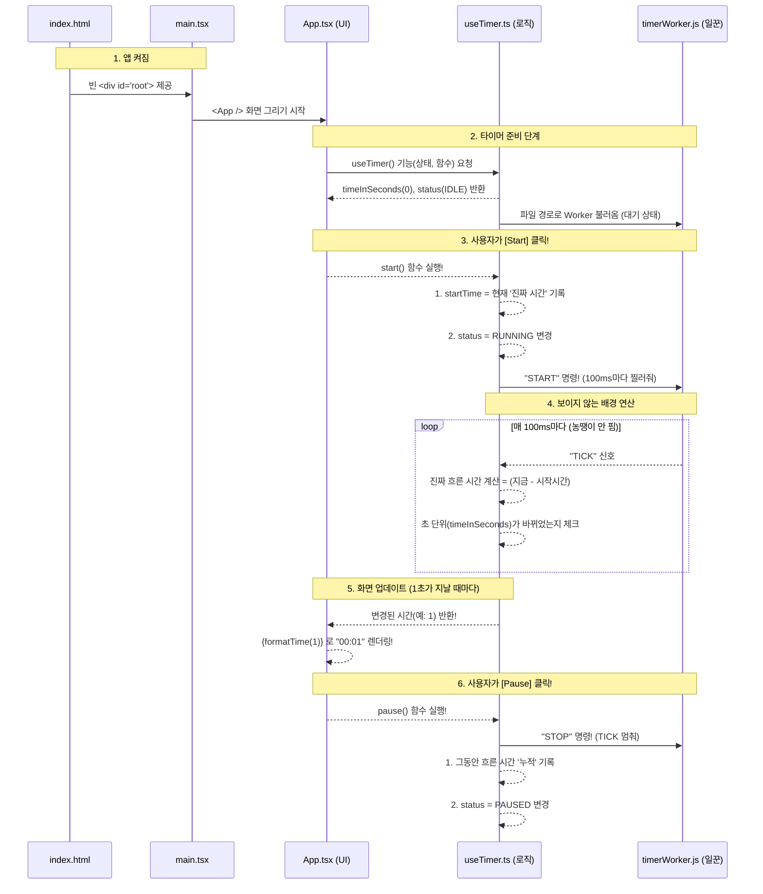

# 타이머 애플리케이션 구조도 및 동작 흐름

본 문서는 면접 및 코드 리뷰를 위해 타이머 애플리케이션의 전체 파일 구조와 내부 동작 원리(Architecture Flow)를 정리한 문서입니다.

## 1. 전체 파일 구조도

프로젝트는 크게 UI를 담당하는 부분, 로직을 담당하는 부분(두뇌), 배경에서 시간을 세는 부분(일꾼)으로 명확히 역할이 분리되어 있습니다.

```text
📁 plang_project/ (프로젝트 최상위 폴더)
│
├── 📄 index.html              <-- 빈 식판 (무대 마련)
│                                  리액트가 화면을 그려넣을 텅 빈 `<div id="root">`가 있는 곳입니다.
│
├── 📁 public/                 <-- 정적 파일 폴더
│   └── 📄 timerWorker.js      <-- [일꾼] 백그라운드 무한 타이머
│                                  화면이 꺼지거나 탭이 넘어가도 절대 농땡이 피우지 않고 
│                                  0.1초마다 메인 화면에 신호를 보내는 보이지 않는 일꾼입니다.
│
├── 📁 src/                    <-- 실제 소스 코드들이 모여있는 곳
│   │
│   ├── 📄 main.tsx            <-- [시작점] 밥상 차리기
│   │                              index.html의 빈 껍데기를 찾아내서 App.tsx 화면을 꽂아 넣습니다.
│   │
│   ├── 📄 App.tsx             <-- [화면/몸통] 타이머 UI 및 리모컨
│   │                              버튼 3개(Start/Pause/Reset)와 시간을 예쁘게 보여주는 
│   │                              진짜 메인 화면 껍데기입니다. 
│   │
│   ├── 📁 hooks/              
│   │   └── 📄 useTimer.ts     <-- [두뇌/로직] 핵심 타이머 계산기
│   │                              timerWorker의 신호를 받아 "진짜 흐른 절대 시간"을 
│   │                              오차 없이 계산해내는 똑똑한 커스텀 훅입니다.
│   │
│   ├── 📄 App.css             <-- App 화면 전용 꾸미기 파일 (스타일)
│   └── 📄 index.css           <-- 프로젝트 전체 기본 꾸미기 파일 (글꼴, 여백 초기화 등)
│
├── 📄 package.json            <-- 프로젝트 설정집 (사용하는 프로그램, 명령어 목록)
├── 📄 vite.config.ts          <-- Vite(번들러) 설정 파일 (빠르게 코드를 압축해 주는 역할)
└── 📄 README.md               <-- 이 프로젝트의 과제 설명서
```

---

## 2. 타이머 동작 흐름도 (Sequence Diagram)

이 앱의 핵심은 **"뷰(View) - 두뇌(Logic) - 일꾼(Worker)" 간의 단방향 데이터 흐름**입니다. 
아래 흐름을 통해 백그라운드 탭에서도 100%의 정확도를 보장하는 원리를 확인할 수 있습니다.



---

## 3. 면접 대비: 아키텍처 설명 스크립트

면접에서 "이 타이머는 어떻게 설계되었나요?"라는 질문을 받았을 때 사용할 수 있는 핵심 대본입니다.

> "제 프로젝트는 크게 3가지 계층으로 역할을 분리했습니다.
> 
> **첫째, 뷰(View) 계층인 `App.tsx`입니다.**
> 여기서는 숫자를 받아와서 예쁘게 `00:00` 포맷으로 보여주거나, 유저가 클릭할 수 있는 버튼의 껍데기만 가지고 있습니다. 버튼을 누르면 두뇌(`useTimer`)에게 '나 클릭됐어!' 하고 알려주기만 하여, 화면 그리기 역할에만 집중합니다.
> 
> **둘째, 두뇌(Logic) 계층인 `useTimer.ts`입니다.**
> React의 Custom Hook 패턴을 사용해서, 흩어지기 쉬운 시간 계산과 상태(IDLE, RUNNING, PAUSED) 관리 로직을 이 파일 하나에 모두 숨겼습니다. 덕분에 `App.tsx`는 타이머 내부가 어떻게 계산되는지 전혀 알 필요가 없습니다.
> 
> **셋째, 백그라운드 일꾼인 `timerWorker.js`입니다.**
> 자바스크립트는 탭이 안 보일 때 성능을 아끼려고 타이머(`setInterval`)를 강제로 지연시킵니다. 이 문제를 원천 차단하기 위해, 화면 스레드와 완전히 분리된 Web Worker에게 '100ms마다 무조건 내 두뇌(`useTimer`)를 찔러줘!' 라고 지시를 내렸습니다.
> 
> 결론적으로, **`[UI 클릭] 👉 [훅에서 시작시간 기록 & 워커 가동] 👉 [워커가 무조건 100ms마다 신호 줌] 👉 [훅에서 절대 시간을 뺄셈하여 초 계산] 👉 [UI 화면 갱신]`** 이라는 단방향 흐름을 구축하여, 어떤 상황에서도 100% 정밀도를 보장하는 완벽한 타이머 아키텍처를 완성했습니다."
