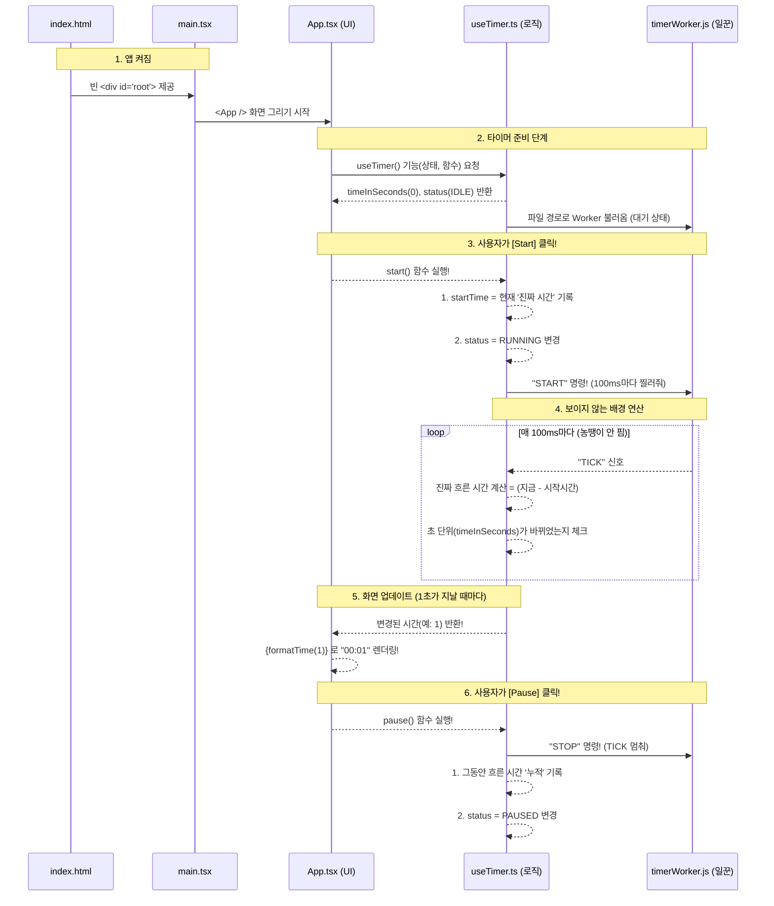

# 타이머 애플리케이션 구조도 및 동작 흐름

## 2. 타이머 동작 흐름도 (Sequence Diagram)

이 앱의 핵심은 **"뷰(View) - 두뇌(Logic) - 일꾼(Worker)" 간의 단방향 데이터 흐름**입니다. 
아래 흐름을 통해 백그라운드 탭에서도 100%의 정확도를 보장하는 원리를 확인할 수 있습니다.

```mermaid
sequenceDiagram
    participant Index as index.html
    participant Main as main.tsx
    participant App as App.tsx (UI)
    participant Hook as useTimer.ts (로직)
    participant Worker as timerWorker.js (일꾼)

    Note over Index,Main: 1. 앱 켜짐
    Index->>Main: 빈 <div id="root"> 제공
    Main->>App: <App /> 화면 그리기 시작

    Note over App,Worker: 2. 타이머 준비 단계
    App->>Hook: useTimer() 기능(상태, 함수) 요청
    Hook-->>App: timeInSeconds(0), status(IDLE) 반환
    Hook->>Worker: 파일 경로로 Worker 불러옴 (대기 상태)

    Note over App,Worker: 3. 사용자가 [Start] 클릭!
    App-->>Hook: start() 함수 실행!
    Hook-->>Hook: 1. startTime = 현재 '진짜 시간' 기록
    Hook-->>Hook: 2. status = RUNNING 변경
    Hook->>Worker: "START" 명령! (100ms마다 찔러줘)

    Note over Hook,Worker: 4. 보이지 않는 배경 연산
    loop 매 100ms마다 (농땡이 안 핌)
        Worker-->>Hook: "TICK" 신호
        Hook-->>Hook: 진짜 흐른 시간 계산 = (지금 - 시작시간)
        Hook-->>Hook: 초 단위(timeInSeconds)가 바뀌었는지 체크
    end

    Note over Hook,App: 5. 화면 업데이트 (1초가 지날 때마다)
    Hook-->>App: 변경된 시간(예: 1) 반환!
    App-->>App: {formatTime(1)} 로 "00:01" 렌더링!

    Note over App,Worker: 6. 사용자가 [Pause] 클릭!
    App-->>Hook: pause() 함수 실행!
    Hook->>Worker: "STOP" 명령! (TICK 멈춰)
    Hook-->>Hook: 1. 그동안 흐른 시간 '누적' 기록
    Hook-->>Hook: 2. status = PAUSED 변경
```

---
